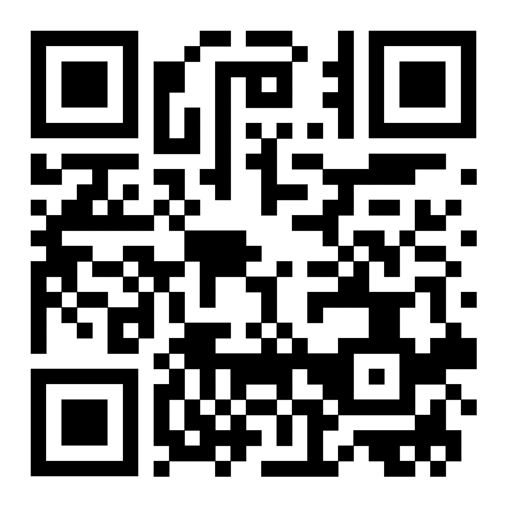
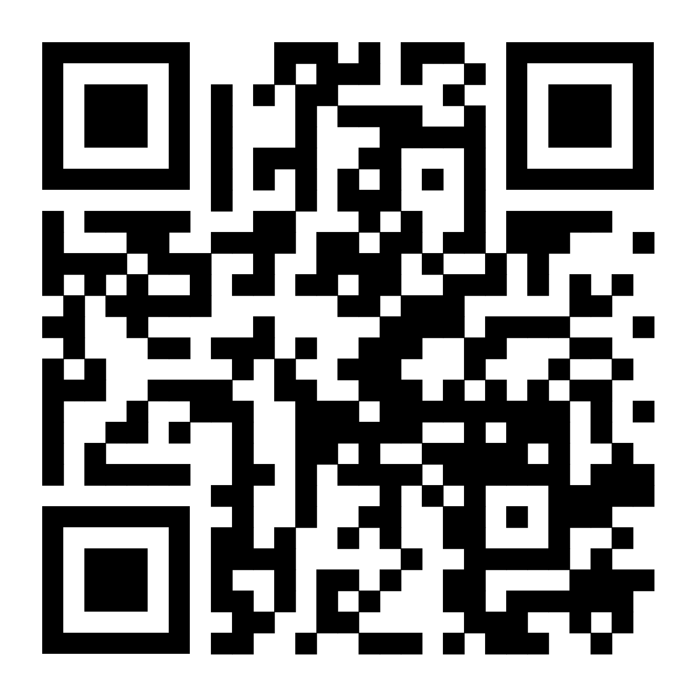

Neuroqueer Naropa
=================

Stepping beyond the neurodiversity paradigm and into exploration of liberation theory, the Neuroqueer Naropa group meets weekly to hold space for emergent topics relevant to accessibility advocacy, coalition building, education resources, hidden disabilities, institutional responsibility, organizing for change, and even social stimming.  Anyone with a neurodivergent diagnosis, questioning whether to pursue diagnosis, self-identified neurodivergence, seeking to transcend identity politics, or simply interested in queering the status quo is encouraged to contribute your support and/or presence via radical acceptance and action promoting inclusive practices on campus and throughout our communities.  Nihil de nobis sine nobis.

Faculty Advisor(s)
------------------

 * Nicole Xenos

Positive initial feedback from everyone emailed!  Meetings pending:

 * Heather Bair
 * Ārādhanā Rakhra
 * Anthony Gallucci

Founding Members
----------------

 * Matthew Larson
 * Katie Young
 * James Sims
 * Hayley Colvard

Meeting Details
---------------

 * Weekly on Monday @ 6-7pm
 * Hybrid attendance model by default
   * Location: Cultural Center (Arapahoe Campus) tenative
     
   * Zoom Link: https://naropa.zoom.us/my/neuroqueer
     

Foundational Agreements
-----------------------

We, as a co-created student group, agree to hold these truths:

 * accommodation first, no saviorism welcome
 * brave spaces, safe isn't good enough
 * compassionate interdependence
 * different is not less than
 * enforcing "normal" is violence
 * 
 * (WIP: pending discussion and ratification)

